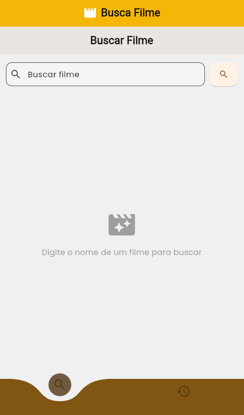
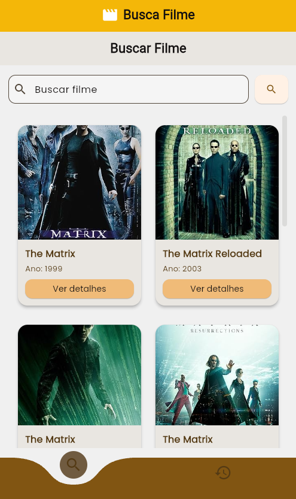
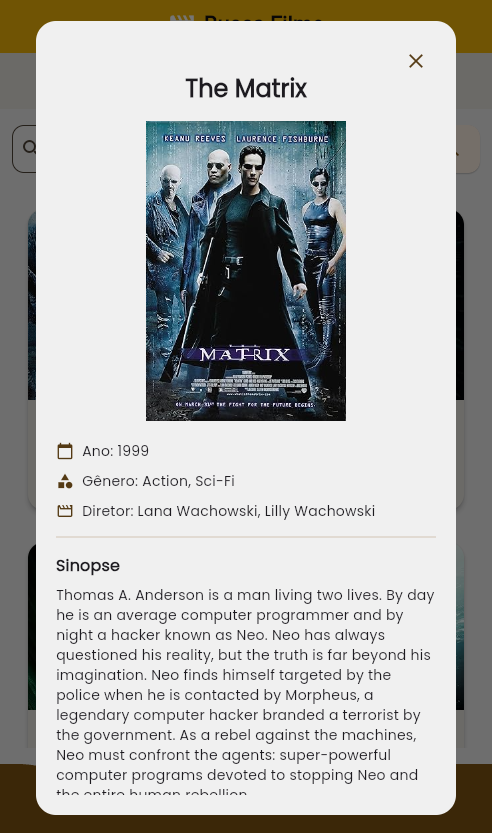
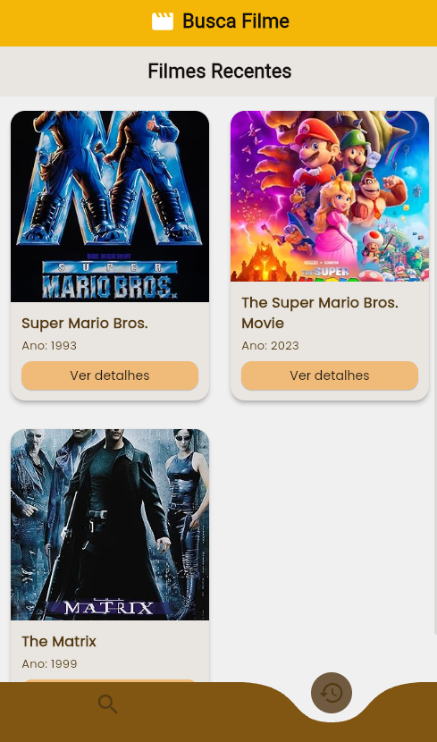

# Movie Search

O projeto consiste um aplicativo de Android onde você pode buscar pela informação de filmes através da integração da [OMDb API](https://www.omdbapi.com/). O projeto foi criado como requerimento para um processo seletivo.

# Como rodar a aplicação

Para isso são necessários:
  
- SDK do Android
- SDK do Flutter
- Aparelho Android em modo desenvolvedor. (Caso queira roda-lo em aparelho.Porem podemos localmente na maquina em versão web)


Para rodar a aplicação será necessário a criação de um arquivo **.env** conforme o exemplo **.env.example** com sua API_KEY fornecida pela [OMDb API](https://www.omdbapi.com/). Para a equipe de seleção estárei enviando por e-mail por segurança.


Após adicionar um arquivo .env rode o comando no terminal:
```
- flutter run
```

# Sobre o projeto

  O projeto foi criado seguindo os requisitos exigidos pelo como utilização das bibliotecas Dio, Bloc e shared_preferences, e separação do projeto em camadas. Foram seguidas boas práticas como princípios de clean code, separação de responsabilidades, onde o lógica de negócio foi separada da UI com o Bloc. Foi atingido um aplicativo simples mas eficaz para busca de filmes e uma UI organizada e responsiva.


## Requisitos Cumpridos

### Funcionalidades

- [x] Tela de busca de filmes (campo de texto + botão de buscar)
- [x] Exibição dos resultados em uma lista com:
  - [x] Título
  - [x] Pôster
  - [x] Ano de lançamento
- [x] Tela de detalhes do filme com:
  - [x] Título
  - [x] Pôster em maior destaque
  - [x] Ano, gênero, sinopse
- [x] Armazenar localmente os últimos 5 filmes buscados
- [x] Exibir os últimos 5 filmes na aba "Recentes"

### Requisitos Técnicos

- [x] Flutter + Dart
- [x] Uso do `dio` para requisições
- [x] Gerência de estado com `Bloc`
- [x] Separação por camadas (mínimo: `data`, `domain`, `presentation`)
- [x] Persistência local com `shared_preferences` ou similar
- [x] Responsividade básica

## Resultados Alcançados 

Tela inicial

  

Após buscar filme

  

Detalhes do filme

  

Aba de recentes mostrando os ultimos 5 filmes vistos
  

## Organização das pastas

```
lib/
├── app/                          # Camada de regras de negócio e contratos
│   ├── data/                     # Lógica de aplicação e serviços
│   │   ├── models                # Models
│   │   ├── repositories          # Interfaces de repositórios (acesso a dados)
│   ├── domain/                   # Lógica de domínio da aplicação
│   │   ├── bloc                  # Entidades de domínio (conceitos de negócio)
│   │   ├── services/             # Regras de negócio
│   ├── presentation/             # Camada de apresentação (UI)
│   │   ├── screens               # Telas da aplicação
│   │   ├── theme                 # Configurações de tema (cores, fontes)
│   │   ├── widgets               # Componentes reutilizáveis de UI
test/                             # Testes automatizados
```

## Ideias de para implementar


- Integrar com firebase para criação de contas e autenticação.
- Integrar biblioteca específica para DI.
- Opção de favoritos com salvamento.
- Aba de favoritos.